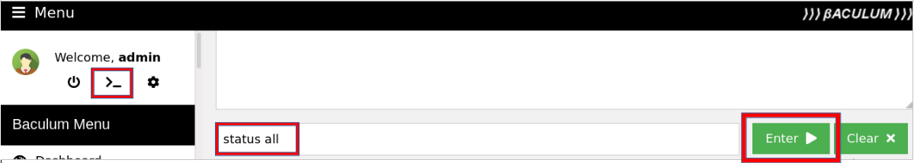

## Description

This is the Bacula Open Source Edition built for Rasperry Pi. The images are based on the official Debian Bullseye Docker image. The Bacula Catalog image is using the official Postgresql 13 Docker image.

If you want to get the containers up and running as quick as possible, you can clone the repo as described below.
This way you will get the default Bacula configuration in the folder "etc".
The configuration can be adapted to your needs in the web interface later on.
The timezone in the containers is inherited from the local time zone on the docker host.

**Requirements**

You need a Raspberry Pi or another ARMHF / ARMV7+ based Linux host system with installed docker engine and docker-compose.


## Setup / Configuration

**Clone the bacula-rpi repository from github**

Change to the directory, where you want to save the bacula-rpi configuration 
```
git clone https://github.com/ixxoid/bacula-rpi
```

**Set configuration file permissions**

The permissions of the Bacula API configuration file needs to be changed.
This allows the Bacula API webserver to save changes made in the webinterface.
```
chmod 666 Baculum_API/files/api.conf
```

**Add a place to store your backups**

If you want to store you backups to disk.
You might want set up a mapping to the mountpoint of your backup disk in the file docker-compose.yaml in the "volumes" section of the Bacula SD container (bacula-sd).
The path to the storage device needs also to be configured in the bacula configuration "etc/bacula-sd.conf". Can be done directly in the file, or in the Baculum Web interface. 
But the setup of the Bacula configuration is out of scope of this documetation.
A link to the documentation is provided at the end of this document.


**Start the Bacula-rpi containers**
Change to the sub-folder where you cloned the git repository and bring the conatainers up and running

```
cd bacula-rpi
docker-compose up -d
```

All the conatainers should now be up and running.

**Baculum API configuration**

Open the Baculum API Website at http://docker-host:9096
The default login is:

- username = admin
- password = admin

The login data can be changed in the gui.
You need to go through the "Configuration wizard".
All the forms will be filled out with a working configuration.
In the step 5 - "authentication to API" you need to choose "Use HTTP Basic authentication". 
For more details on the Baculum API configuration, consult the linked documentation below.

**Baculum web configuration**

Open the Baculum Web page at http://docker-host:9095
You need to go through the configuration forms.
On the page "Add API host" add "baculum-api" in the field "IP-Address/Hostname", this is the default set in the docker-compose.yaml.

****

If you enter the wrong hostname by mistake and safe the configuration, you might get an unrecoverable fault. In that case you need to recreate the Baculum Web container.
This seems to be a bug of Baculum Web.

**Bacula configuration**

The included example configuration uses a volume to share the bacula working directory /opt/bacula/working . This allows to backup the catalog db dumps.
To adapt the configuration to you personal needs, you can either edit the config files in /etc or change the config in the Baculum Web Gui.

## Tests

Login to the Baculum Web page at http://docker-host:9095
Open the Bacula Console with clicking on ">_".  
Type "status all" and click on "Enter".  
Check the output for any faults.

****

## Security

You might want to limit access to the DB port 5432 and also change the default DB credentials in the docker-compose.yaml file. 
To enable SSL encryption for the baculum-api and baculum-web access, you can add a reverse proxy to the docker-compose.yaml

## Customize / Build the images

If you want to customize or build the images on your own, you might want to change the configuration options for the build in the bacula-rpi/Bacula_Common/dockerfile .


## Links

Bacula homepage:
https://www.bacula.org/

Baculum (bacula-gui):
https://baculum.app/doc/index.html

**PostgreSQL**
https://hub.docker.com/_/postgres/
